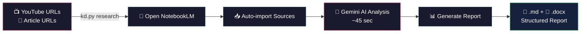

# NotebookLM Knowledge Distillery 🎓

[](https://opensource.org/licenses/MIT)
[](https://www.python.org/downloads/)

> 🇹🇼 **知識蒸餾器** — 你只要把 YouTube 影片連結、播放清單、頻道或網路文章丟進來，它會自動打開 Google NotebookLM，讓 Gemini AI 幫你分析所有內容，然後產出一份結構完整的研究報告。支援單個影片、播放清單、頻道最新影片，還有批次處理模式。不用自己花兩小時看影片、做筆記，4 支影片大概 3-5 分鐘就能搞定。適合做投資研究、技術學習、市場調查，任何需要快速消化大量影片內容的場景都能用。
>
> 🇺🇸 **Knowledge Distillery** — Just drop in YouTube links, playlists, channels, or article URLs, and it automatically opens Google NotebookLM, lets Gemini AI analyze all the content, and generates a well-structured research report. Supports individual videos, playlists, latest channel videos, and batch processing mode. No need to spend hours watching videos and taking notes — 4 videos take about 3-5 minutes. Perfect for investment research, technical learning, market analysis, or any scenario where you need to quickly digest large amounts of video content.

---

## 🎬 How It Works



### 📋 Example Output

```
科技研究_KD/
├── 2026-02-27_核融合Helion_KD報告.md          # Markdown report
├── 2026-02-27_核融合Helion_KD報告.docx        # Word document
├── 2026-02-27_核融合Helion_KD報告_中文.md     # Chinese version
└── 2026-02-27_核融合全球技術地圖_KD報告.md    # Multi-source synthesis
```

> ⚡ **Real result**: 4 YouTube videos about nuclear fusion → 1 structured research report in 3 minutes.

---

## 📦 Installation

### Prerequisites
- **Python 3.10+**
- **[uv](https://docs.astral.sh/uv/)** (recommended) or pip
- **[OpenClaw](https://github.com/openclaw/openclaw)** with browser automation enabled
- **Google account** with [NotebookLM](https://notebooklm.google.com/) access
- **macOS** (uses `pbpaste` for clipboard; Linux support coming soon)

### Setup

```bash
# 1. Clone the repo
git clone https://github.com/mchsu0722/notebooklm-knowledge-distillery.git
cd notebooklm-knowledge-distillery

# 2. Install dependencies (using uv)
uv sync

# 3. Make sure OpenClaw browser is running
openclaw browser start

# 4. Log in to Google NotebookLM in the OpenClaw browser
#    (only needed once — session persists)
```

That's it! You're ready to go. 🚀

---

## 🚀 Quick Start

### Individual URLs
```bash
uv run scripts/kd.py research \
  --topic "Financial Research" \
  --urls "https://youtube.com/watch?v=xxx,https://youtube.com/watch?v=yyy" \
  --format briefing
```

### YouTube Playlist
```bash
uv run scripts/kd.py research \
  --topic "AI Technology Trends" \
  --playlist "https://youtube.com/playlist?list=PLxxx" \
  --max-videos 10 \
  --format study-guide
```

### YouTube Channel (Latest Videos)
```bash
uv run scripts/kd.py research \
  --topic "Tech News Analysis" \
  --channel "https://youtube.com/@channelname" \
  --max-videos 5 \
  --format briefing
```

### Batch Processing
```bash
uv run scripts/kd.py batch config.yaml
```

---

## 📋 Command Reference

### Research Command
```bash
uv run scripts/kd.py research [OPTIONS]
```

**Required:**
- `--topic TOPIC`: Topic name (used as folder name)
- **One of:** `--urls URLS` | `--playlist URL` | `--channel URL`

**Optional:**
- `--max-videos N`: Max videos from playlist/channel (default: 10, max: 50)
- `--format {briefing|study-guide|blog}`: Report format (default: briefing)
- `--output OUTPUT`: Output directory (default: workspace/{topic}_KD/)
- `--profile PROFILE`: Browser profile (default: openclaw)

### Batch Command
```bash
uv run scripts/kd.py batch CONFIG_FILE [--profile PROFILE]
```

---

## 📊 Batch Configuration

Create a YAML file for multiple research tasks:

```yaml
- topic: "金融投資策略"
  urls:
    - https://youtube.com/watch?v=example1
    - https://youtube.com/watch?v=example2
  format: briefing

- topic: "AI技術趨勢" 
  playlist: https://youtube.com/playlist?list=PLexample
  max_videos: 5
  format: study-guide

- topic: "綠色能源發展"
  channel: https://youtube.com/@channelexample
  max_videos: 8
  format: briefing
```

See [examples/batch_config.yaml](./examples/batch_config.yaml) for full example.

---

## 📂 Output Structure

```
{topic}_KD/
├── README.md                          # Index with NotebookLM link
└── YYYY-MM-DD_{topic}_KD報告.md       # Full structured report
└── YYYY-MM-DD_{topic}_KD報告.docx     # Word document (if python-docx available)
```

## 📋 Examples

- **[Sample Report](./examples/sample_report.md)**: Example research report on nuclear fusion technology
- **[Batch Configuration](./examples/batch_config.yaml)**: YAML file template for batch processing

---

## ⚙️ How It Works

1. Opens NotebookLM in browser (automated via OpenClaw)
2. Creates new notebook & batch imports URLs
3. Waits for Gemini AI analysis (~45 seconds)
4. Generates report in selected format
5. Copies and saves report to local folder

---

## 🔧 Requirements

| Requirement | Why |
|-------------|-----|
| [OpenClaw](https://github.com/openclaw/openclaw) | Browser automation to control NotebookLM |
| [uv](https://github.com/astral-sh/uv) | Python package runner |
| macOS | Uses `pbpaste` for clipboard |
| Google account | NotebookLM access |

---

## 📝 Notes

- Only works with **public** YouTube videos (with transcripts)
- Articles must be publicly accessible (no paywalls)
- NotebookLM has a **50-source limit** per notebook
- **Playlist/Channel**: Auto-limits to 50 videos max (configurable via `--max-videos`)
- **Batch mode**: Processes tasks sequentially with 10-second pauses
- 3-10 URLs per research session recommended for optimal results
- Reports default to Traditional Chinese (customizable via NotebookLM settings)

---

## 🐛 Troubleshooting

| Issue | Solution |
|-------|----------|
| Import failed | Verify URLs are public and have transcripts |
| Report timeout | Wait longer; check NotebookLM UI manually |
| Clipboard empty | Ensure `pbpaste` works; check if copy button was clicked |
| Browser not found | Run `openclaw browser start` first |
| NotebookLM login | Log in to Google in the OpenClaw browser profile |

---

## 🤝 Contributing

Contributions are welcome! Please:

1. Fork the repo
2. Create a feature branch (`git checkout -b feature/amazing-feature`)
3. Commit your changes (`git commit -m 'Add amazing feature'`)
4. Push to the branch (`git push origin feature/amazing-feature`)
5. Open a Pull Request

---

## 📄 License

MIT

---

Built with [OpenClaw](https://github.com/openclaw/openclaw) 🦀
